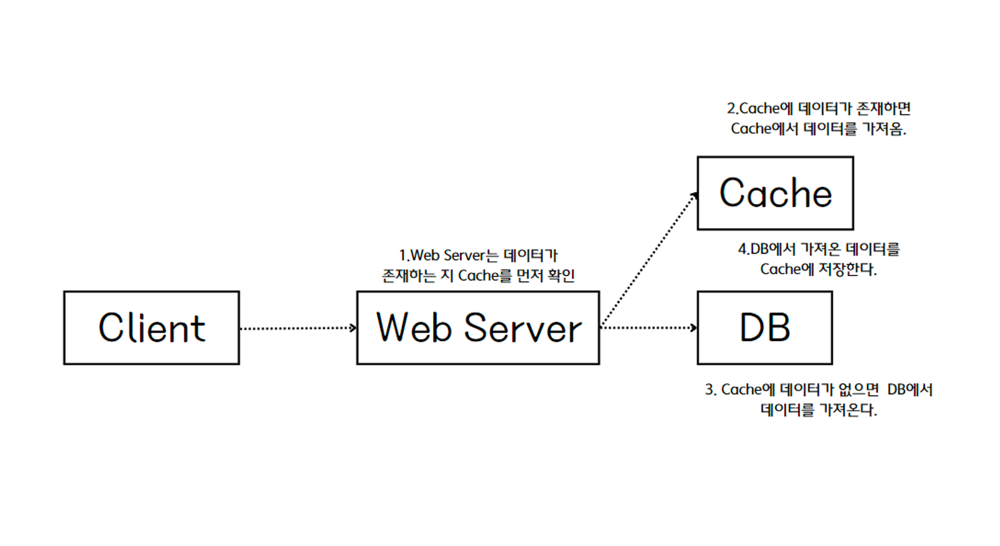
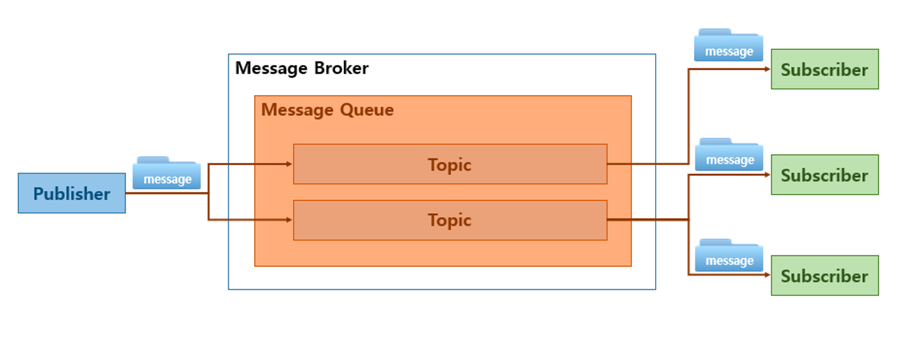
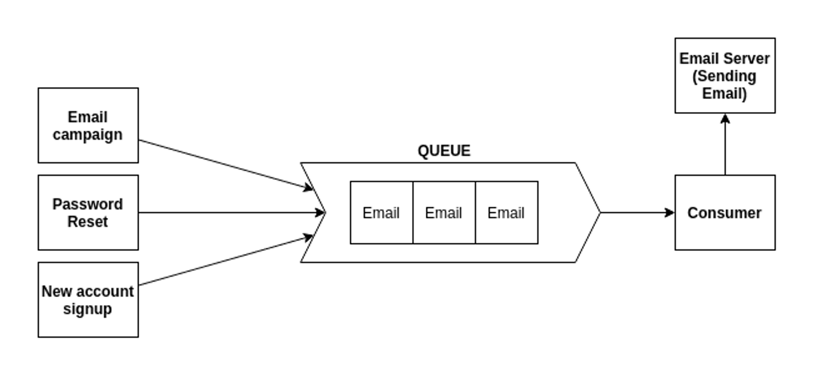

<aside>
💡 <b>시스템 설계 면접에서 우리는 무엇을 파악해야 하는가?</b>

1. 시스템 요구사항
2. 제약사항
3. 성능 병목 지점

⇒ 올바른 전략과 지식으로 규모 확장성을 갖춘 시스템을 설계해보자!

</aside>

## 서버의 사용자 요청 처리 과정

1. 도메인 이름(www.naver.com)을 이용하여 웹 사이트에 접속
2. 우리 시스템 외부의 DNS 서버를 이용해 IP주소로 변환
    
    IP주소=웹 서버 주소
    
3. 해당 IP주소로 HTTP 요청 전달
4. 요청을 받은 웹 서버는 HTML 페이지나 JSON 형태의 응답을 반환
    - 웹 APP : 서버 구현 + 프레젠테이션(클라이언트 구현)
    - 모바일 APP : HTTP 프로토콜을 통한 JSON 형태의 요청/응답 데이터

## 데이터베이스

보통 <b>데이터베이스 서버(데이터 계층)</b>를 <b>웹/모바일 트래픽 처리 서버(웹 계층)</b>과 분리하여 독립적인 확장이 가능한 형태로 두는 것을 많이 볼 수 있다. 

### 종류

|  | 대표적인 예시 | 주요 특징 |
| --- | --- | --- |
| RDBMS | MySQL, Oracle, PostgreSQL | 태아블 간 관계에 따라 조인 사용 |
| NoSQL | CouchDB, Neo4j, Cassandra, HBase, Amazon DynamoDB | - 키-값 저장소
- 그래프 저장소
- 칼럼 저장소
- 문서 저장소 |

### 언제 비관계형이 더 적합할까?

- 아주 낮은 응답 지연시간 요구
- 다루는 데이터가 비정형(비관계형)
- 데이터(JSON, YAML, XML 등) 직렬화 및 역직렬화 가능
- 아주 많은 양의 데이터를 저장하는 경우

## Scale Up(vertical) VS Scale Out(horizontal)

| Scale Up | 수직적 규모 확장 | 서버에 고사양 자원(더 좋은 CPU, 더 많은 RAM 등)을 추가하는 행위 |
| --- | --- | --- |
| Scale Out | 수평적 규모 확장 | 더 많은 서버를 추가하여 성능을 개선하는 행위 |

서버로 유입되는 트래픽 양이 적을 때 : 수직적 확장이 좋은 선택! (단순해서 ㅋ)

<aside>
⚠️ 수직적 확장의 한계

1. 한 대의 서버에 CPU나 메모리를 무한대로 증설할 방법 X
2. 장애에 대한 자동복구(failover) 방안이나 다중화(redundancy) 방안 제시 X
    
    → 서버에 장애가 발생하면 ALL STOP
    
</aside>

위와 같은 이유로, 주로 수평적 확장이 쓰이고 그 방식으로는 사용자의 무중단 경험을 위해 **로드밸런서** 또는 **부하 분산기**를 도입한다.

### 로드밸런서

로드밸런서는 Public IP로의 요청이 들어오면 Private IP로 변환하여 **같은 네트워크에 속한 서버와의 통신**만 가능하도록 한다. 

웹 서버를 Scale Out 해두기만 하면 로드밸런서가 알아서 트래픽을 분산하므로 감당할 수 없는 트래픽이 왔을 때 보다 우아하게 대처할 수 있게 된다.

### 데이터베이스 다중화

***다중화란?***

서버 사이에 주(master)-부(slave) 관계를 설정하고, 데이터 원본은 주 서버에, 사본은 부 서버에 저장하는 방식

많은 DBMS에서 다중화를 지원하며, 
주로 쓰기 연산(Insert, Delete, Update)은 마스터에서만, 슬레이브에서는 읽기 연산(Read)만 지원한다. 

*주로 쓰기 연산 < 읽기 연산의 비중을 가지므로, **부 데이터베이스**의 수가 주 데이터베이스의 수보다 많다!

<aside>
🌙 다중화의 이점

1. 병렬 처리 가능한 질의 수 多 ⇒ **성능** UP
2. 지역적으로 떨어진 여러 장소에 데이터 다중화 
    
    ⇒ 데이터의 **안정성**과 **가용성** 보장
    
</aside>

- 데이터베이스 서버가 다운된다면?
    
    ***부 서버***
    
    - 1대 : 읽기 연산이 한시적으로 주 서버로 전달, 새로운 부 서버 추가
    - 여러 대 : 다른 부 서버로 분산
    
    ***주 서버*** 
    
    - 1대 : 부 서버가 주 서버로, 새로운 부 서버 추가
        
        ⚠️ 대체된 부 서버의 데이터가 최신 상태가 아닐 수 있어 보다 복잡한다 → 이는 다중 마스터 /. 원형 다중화 방식으로 대처할 수 있다.
        
    
    ****부 서버는 1대일 수도 여러 대일 수도 있다!***
    

## 캐시

<aside>
💡 IDEA

> 응답시간을 개선해보자!
> 

웹 서버, 데이터베이스 서버, 로드밸런서로 이루어진 아키텍처에서 응답시간 개선을 고려해보고자 한다면, **캐시를 도입하고 정적 콘텐츠는 CDN으로 옮기는 방식**을 고안해볼 수 있다. 

</aside>

값비싼 연산 결과 또는 자주 참조되는 데이터를 메모리 안에 두고, 뒤이은 요청이 보다 빨리 처리될 수 있도록 하는 저장소

→ 애플리케이션의; 성능은 DB를 얼마나 자주 호출하느냐에 따라 좌우되는데, 캐시가 바로 이러한 문제를 완화할 수 있다!

### 캐시 계층

> 데이터가 잠시 보관되는 곳
> 

**읽기 주도형 캐시 전략(read-through caching strategy)**

1. 요청을 받은 웹 서버가 캐시에 응답이 저장되어 있는지 확인
2. 데이터가 존재한다면 반환
3. 데이터가 없다면 DB 쿼리를 통해 데이터를 찾아 캐시에 저장한 뒤 반환

**이외 다양한 캐시 전략으로 캐시할 데이터 종류, 크기, 액세스 패턴에 맞게 최적화할 수 있다!*

[이점]

- 성능 개선
- DB의 부하를 줄일 수 있음
- 캐시 계층의 규모를 독립적으로 확장 가능

### 캐시 사용 시 유의할 점

1. 데이터 갱신은 자주 X, 참조는 빈번하게 일어나는 경우
2. 데이터의 특성이 휘발적인가?  *영속적으로 보관할 데이터는 지속적 저장소에 두어야 함
3. 데이터의 만료기한이 존재하며, 적당해야 함
4. 저장소의 원본 갱신과 캐시의 갱신이 단일 트랜잭션으로 이루어지는 등 일관성이 유지되어야 함
5. 캐시 서버 = 단일 장애 지점(SPOF, Single Point Of Failure)가 되는 것을 방지하기 위해, 여러 지역에 걸쳐 캐시 서버를 분산시켜야 함
6. 캐시 메모리를 과할당(overprivision)하여 데이터가 자주 밀려나버리거나 갑자기 데이터의 양이 늘어나는 경우에 대비
7. 캐시가 꽉 찬 경우의 **데이터 방출 정책** 
    
    *자주 쓰이는 정책
    | 이름 | 설명 |
    | --- | --- |
    | LRU(Least Recently Used) | 마지막으로 사용된 시점이 가장 오래된 데이터를 내보내는 정책 |
    | LFU(Least Frequently Used) | 사용된 빈도가 가장 낮은 데이터를 내보내는 정책 |
    | FIFO(First In First Out) | 가장 먼저 캐시에 들어온 데이터를 가장 먼저 내보내는 정책 |

## 콘텐츠 전송 네트워크(CDN)

> 정적 콘텐츠를 전송하는 데 쓰이는, 지리적으로 분산된 서버의 네트워크
> 
> 
> → 이미지, 비디오, CSS, javascript 파일 등을 캐시
> 

요청 경로, 질의 문자열, 쿠키, 요청 헤더 등의 정보에 기반하여 HTML 페이지를 캐시하는 것

**[과정] 어떤 사용자가 웹 사이트를 방문하면, 그 사용자에게 가장 가까운 CDN 서버가 정적 콘텐츠를 전달**

*이때 사용자와 CDN 사이의 거리에 따라 로딩 속도가 달라진다.

1. 사용자가 이미지 url을 이용해 정적 콘텐츠에 접근한다. *URL의 도메인은 CDN 서비스 사업자가 제공한 것
2. CDN 서버의 캐시에 해당 이미지가 없는 경우, 서버는 원본 서버에 요청하여 파일을 가져온다.
    
    *원본 서버(Origin) - 웹 서버 or AWS S3와 같은 온라인 저장소
    
3. 원본 서버가 파일을 CDN 서버에 반환한다.  → 응답 HTTP Header - 해당 파일이 얼마나 오래 캐시될 수 있는지에 대한 TTL(Time-To-Live) 값이 들어있음
4. CDN 서버는 파일을 캐시하고 사용자에게 반환한다. (TTL의 시간만큼 캐시)
5. 만료되지 않은 이미지에 대한 요청은 캐시를 통해 처리된다. 

### CDN 사용 시 고려해야 할 사항

- 비용 : 자주 사용되지 않는 콘텐츠는 굳이 CDN에서 처리할 필요 X
- 적절한 만료 기한 설정 : 특히 시의성이 중요한 콘텐츠는 적당한 만료 시점을 잘 정해야 함
- CDN 장애에 대한 대처 방안 : CDN이 일시적으로 응답하지 않는 경우에는 원본에서 직접 콘텐츠를 가져와 제공하는 등 대안이 존재해야 함
- 콘텐츠 무효화 방법 : CDN 서비스에서 제공하는 무효화 API 사용  or  Object Versioning(콘텐츠의 다른 서비스)하는 방식이 주로 사용됨

## 무상태(stateless) 웹 계층

> *웹 계층을 수평적으로 확장해보자!*
> 

→ 상태 정보(ex. 사용자 세션 데이터)를 웹 계층에서 제거해야 함

HOW? 지속적 저장소에 상태 정보를 보관하고, 필요할 때 가져오도록 하는 전략 이용

클라이언트의 요청이 서버의 종류에 종속되지 않게 하기 위하여 로드밸런서는 **고정 세션(sticky session)**이라는 기능을 제공하여, 인증정보와 같은 내용을 보관하기도 한다. 

BUT 이는 부담이 크기 떄문에, 주로 세션 데이터를 웹 계층에서 분리하고 지속성 스토리지인 **공유 저장소(shared storage)**에 저장해두고, 상태 정보를 가져오는 경우가 많이 사용된다. 

- NoSQL
- Memcached/Redis와 같은 캐시 시스템

**⇒ 이를 통해 트래픽 양에 따라 자동 규모 확장이 가능해진다.**

## 데이터 센터

장애가 없는 상황에서 사용자는 가장 가까운 데이터 센터로 안내되는데, 이러한 절차를 지리적 라우팅(geoDNS-routing / geo-routing)이라고 부른다. 

→ geoDNS : 사용자의 위치에 따라 도메인 이름을 어떤 IP주소로 변환할지 결정할 수 있도록 해주는 DNS 서비스

<aside>
💡 예시
데이터 센터A → x%의 사용자

데이터 센터B → (100-x)%의 사용자

**데이터 센터 중 하나에 심각한 장애가 발생하면 모든 트래픽은 장애가 없는 데이터 센터로 전송된다.** 

### 다중 데이터센터 아키텍처

- 트래픽 우회 : 사용자에게서 가장 가까운 데이터센터로 트래픽을 보내는 효과적인 방법
- 데이터 동기화 : 각 데이터센터의 DB마다 데이터 동기화가 동일하게 이루어져야 하는데, 이를 위해 데이터를 여러 데이터센터에 걸쳐 다중화해야 함
- 테스트와 배포 : 웹 사이트 or 어플리케이션을 여러 위치에서 테스트 해보기 → 자동화된 배포 도구는 모든 데이터 센터에 동일한 서비스가 설치되도록 하는 데 중요한 역할을 함
</aside>

## 메시지 큐

> 메시지의 무손실을 보장하는, 비동기 통신을 지원하는 컴포넌트
> 
> 
> #메시지_버퍼_역할  #비동기_전송
> 

****무손실(durability)이란?*** 

메시지 큐에 일단 보관된 메시지는 소비자가 꺼낼 때까지 안전히 보관된다는 특성

분산 시스템에서 더 큰 규모로 확장하기 위하여 시스템의 컴포넌트를 분리하여 각기 독립적으로 확장될 수 있도록 해야 하는데, 이를 위한 핵심 전략 중 하나가 **메시지 큐**이다. 

### 기본 아키텍처

1. 생산자(producer)/발행자(publisher)라고 불리는 입력 서비스가 메시지를 만들어 메시지 큐에 publish 한다. 
2. 큐에 연결된 소비자(consumer) / 구독자(subscriber)라고 불리는 서비스 or 서버가 메시지를 받아 그에 맞는 동작을 수행한다.

메시지 큐를 이용하면 서비스 or 서버 결합이 느슨해져, 규모 확장성이 보장되어야 하는 안정적 애플리케이션을 구상하기 좋다. 즉, 생산자나 소비자 프로세스가 다운되는 경우에도 메시지 발행 및 수신에는 영향이 가지 않는다.

<aside>
💡 예시 - 이메일 전송 작업

1. 웹 서버에서 이메일(**message**)에 관한 작업(**job**)들을 메시지 큐에 넣는다.
2. 이메일 프로세스(**worker**)들은 이 작업을 메시지 큐에서 꺼내서 비동기적으로 이메일 서버로 작업을 전송함으로써 완료한다. 

⇒ 생산자와 소비자 서비스의 규모가 각기 독립적으로 확장될 수 있다.

</aside>

- 큐의 크기가 커지면 더 많은 처리기 프로세스를 추가해야 처리 시간을 줄일 수 있다.
- 큐가 거의 항상 비어 있는 상태라면, 처리기 프로세스의 수는 줄일 수 있다.

## 로그, 메트릭 그리고 자동화

프로젝트의 규모가 커질수록 필수적인 도구를 알아보자.

### 로그(log)

에러 로그를 모니터링하면 시스템의 오류와 문제들을 보다 쉽게 찾아낼 수 있다!

- 서버 단위의 모니터링
- 단일 서비스로 로그를 모아주는 도구 활용 (편리하게 로그 검색 및 조회 가능)

### 메트릭(metric)

메트릭을 잘 수집하면 사업 현황에 관한 유용한 정보를 얻을 수도 있고, 시스템의 현재 상태를 손쉽게 파악할 수도 있다. 

**[유용한 지표]**

| 호스트 단위 메트릭 | CPU, 메모리, 디스크 I/O에 관한 메트릭 |
| --- | --- |
| 종합(aggregated) 메트릭 | 데이터베이스 계층의 성능, 캐시 계층의 성능 |
| 핵심 비즈니스 메트릭 | 일별 능동 사용자(daily active user), 수익(revenue), 재방문(retention)  |

### 자동화(automation)

시스템이 크고 복잡해질수록 생산성을 높이기 위해 자동화 도구를 활용해야 한다. 

- CI (지속적 통합) → 개발자가 작성한 코드에 대한 검증 절차 자동화로 문제 감지 가능
- 빌드, 테스트, 배포 등의 절차 자동화

## 데이터베이스의 규모 확장

> 저장할 데이터가 많아지면 데이터베이스에 대한 부하도 증가한다.
> 

*→ 어떻게 DB를 증설할 수 있을까?*

### **수직적 확장(Scale Up)**

기존 서버에 더 많은, or 고성능의 자원(CPU, RAM, 디스크 등)을 증설하는 방법

<aside>
⚠️ 심각한 약점

1. 데이터베이스 서버 하드웨어에 한계가 있어 무한 증설은 불가 ⇒ 사용자가 계속 늘어나면 결국 한 대 서버로는 감당 X
2. SPOF로 인한 위험성 大
3. 비용 多 *고성능 서버일수록 가격이 크게 뜀
</aside>

### **수평적 확장(Sharding, 샤딩)**

더 많은 서버를 추가함으로써 성능을 향상시키는 방법

`샤딩` : 대규모 데이터베이스를 `샤드`(shard)라 불리는 작은 단위로 분할하는 기술

**모든 샤드는 같은 스키마를 쓰지만 샤드에 보관되는 데이터 사이에는 중복이 없다.*

사용자 데이터를 각 샤드 노드에 저장한다고 하자.

그렇다면, 사용자 ID에 따라 해시 함수로 보관될 샤드 번호를 정하는 샤딩 전략을 사용할 수 있다. 이때 **샤딩 키(sharding key, = 파티션 키)**를 어떻게 지정하느냐에 따라 효율을 좌우하는데, 사용자 ID가 바로 샤딩 키에 해당하는 것이다.

⭐ 샤딩 키를 통해 올바른 데이터베이스에 쿼리를 보내 데이터 조회/변경을 처리하므로 효율을 높일 수 있고, 가장 데이터를 고르게 분할할 수 있는 하나 이상의 컬럼으로 지정해야 한다. 

<aside>
⚠️ 샤딩 도입 시, 풀어야 할 새로운 문제

1. **데이터의 재 샤딩(resharding)**
    1. 데이터가 너무 많아져서 하나의 샤드로는 더이상 감당하기 어려울 때
    2. 샤드 간 데이터 분포가 균등하지 못하여 어떤 샤드에 할당된 공간 소모가 다른 샤드에 비해 빨리 진행될 때
    
    = **샤드 소진(shard exhaustion)** 현상
    
    샤드 키를 계산하는 함수를 변경하고 데이터를 재배치해야 한다. 안정 해시(5장) 기법을 활용하면 이 문제를 해결할 수 있다!
    
2. **유명인사(celebrity) 문제 (= 핫스팟 키 문제)**
    
    특정 샤드에 질의가 집중되어 서버에 과부하가 걸리는 문제
    
    *→ 유명인사들이 모두 같은 샤드에 있다고 가정할 때, 이 데이터를 가지고 사회 관계망 어플리케이션을 구축하고자 한다면?*
    
    결국 해당 샤드는 read 연산으로 인해 과부하가 걸리게 될 것이다.
    
    - 유명인사들을 각각에 샤드 하나씩 할당하도록 변경
    - 더 잘게 샤드를 쪼개는 방법
3. **조인과 비정규화(join and de-normalization)**
    
    하나의 데이터베이스를 여러 샤드 서버로 쪼개고 나면, 여러 샤드에 걸친 데이터를 조인하기가 힘들어진다. 
    
    → 이를 해결하는 방법은 데이터베이스를 비정규호하여 하나의 테이블에서 질의가 수행될 수 있도록 하는 것이다. 
    
</aside>

## 백만 사용자, 그리고 그 이상

> 시스템의 규모를 확장하는 것은 지속적이고 반복적인 과정이다.
> 

수백만 사용자 이상을 지원하려면 새로운 전략을 도입해야 하고 지속적으로 시스템을 가다듬어야 할 것이다. 

### 정리

- 웹 계층은 무상태 계층으로
- 모든 계층에 대한 다중화 도입
- 가능한 한 많은 데이터를 캐시할 것
- 여러 데이터 센터를 지원할 것
- 정적 콘텐츠는 CDN을 통해 서비스할 것
- 데이터 계층은 샤딩을 통해 그 규모를 확장할 것
- 각 계층은 독립적 서비스로 분할할 것
- 시스템을 지속적으로 모니터링하고, 자동화 도구들을 활용할 것
