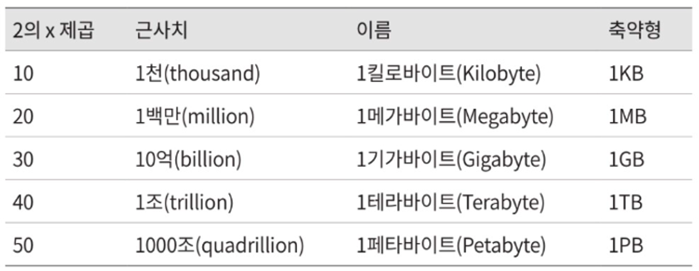
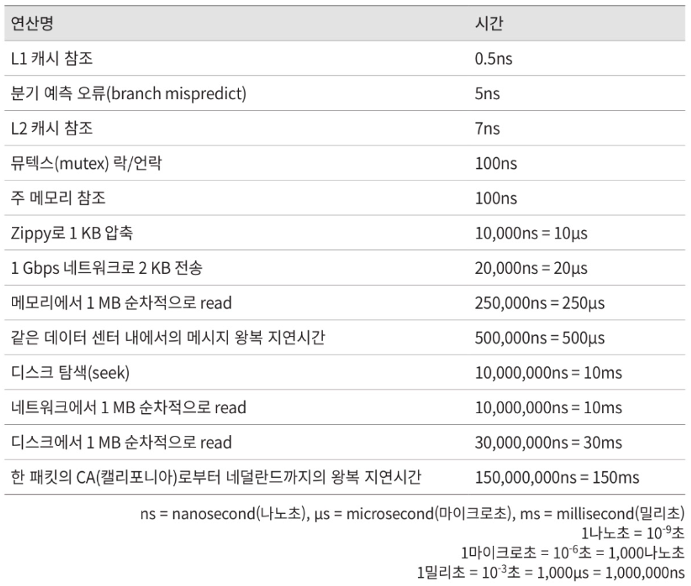
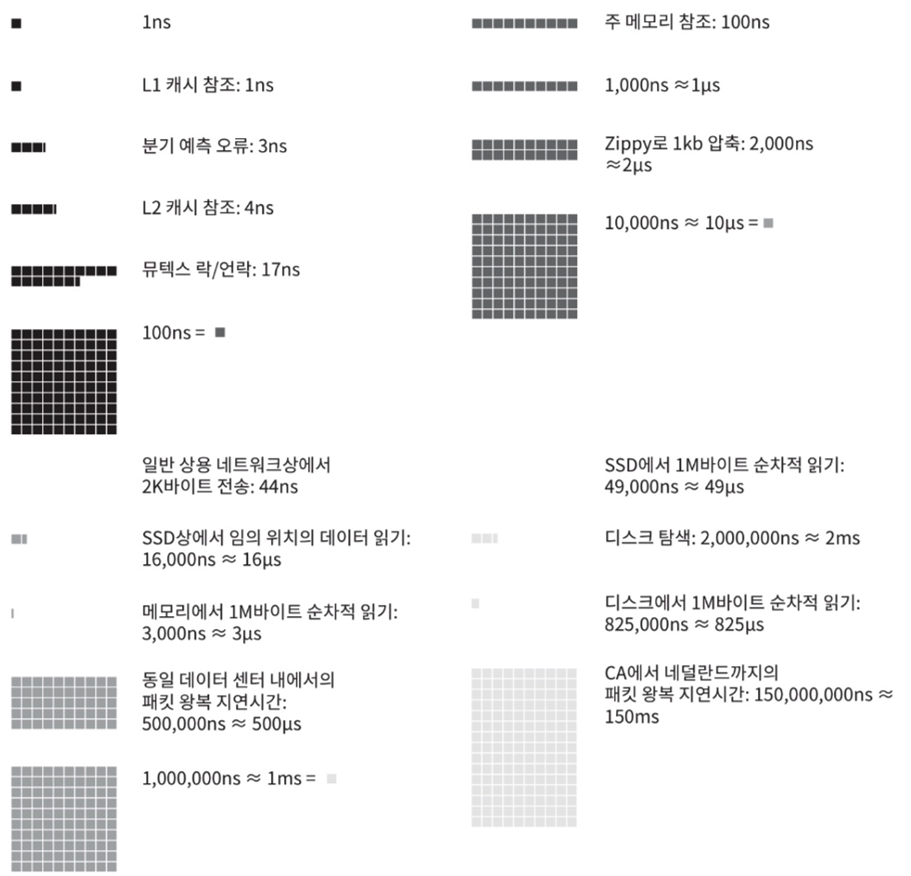
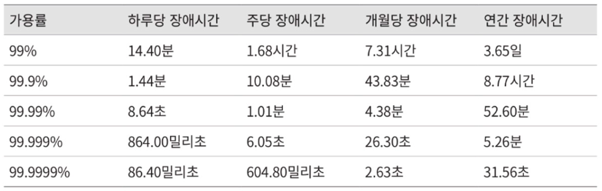

> ***시스템 용량이나 성능 요구사항을 개략적으로 추정하라!***
> 

### 개략적인 규모 추정(back-of-the-envelope estimation)

보편적으로 통용되는 성능 수치상에서 사고 실험을 행하여 추정치를 계산하는 행위

→ 어떤 설계가 요구사항에 부합할 것인지 보기 위한 것

<aside>
📄 <b>`규모 확장성`</b> 을 표현하는 지표

- 2의 제곱수
- 응답지연 값 (latency)
- 가용성에 관계된 수치
</aside>

## 2의 제곱수

분산 시스템에서 다루는 데이터 양은 매우 크다. 

### 데이터 볼륨 단위

- 최소 단위 : 1 byte (= 8 bits)
- ASCII 문자 하나가 차지하는 메모리 크기

## 응답지연 값

위는 컴퓨터 연산들의 처리 속도를 나타낸 지표이다. 

**[분석 결과]**

- 메모리는 빠르지만 디스크는 아직도 느리다
- 디스크 탐색(seek)은 가능한 한 피하라
- 단순한 압축 알고리즘은 빠르다
- 데이터를 인터넷으로 전송하기 전에 가능하면 압축하라
- 데이터 센터는 보통 여러 지역에 분산되어 있고, 센터들 간에 데이터를 주고받는 데 시간이 걸린다

## 가용성에 관계된 수치들

### `고가용성`

> 시스템이 오랜 시간 동안 지속적으로 중단 없이 운영될 수 있는 능력
> 

→ 표현 : 퍼센트(%) 단위

대부분 99~100%(시스템이 단 한 번도 중단된 적이 없는 경우)의 값을 갖는다!

### `SLA(Service Level Agreement)`

> 서비스 사업자와 고객 사이에 맺어진 합의
> 
> 
> ***“서비스 사업자가 제공하는 서비스의 가용시간(uptime)은 공식적으로 99% 이상의 SLA를 제공한다.”***
> 

→ 서비스 사업자(service provider)가 보편적으로 사용함

ex. 아마존, 구글, 마이크로소프트

*9의 개수와 시스템 장애시간(downtime) 사이의 관계

‘9’가 많을수록 가용성이 좋다!

## 예제: 트위터 QPS와 저장소 요구량 추정

<aside>
💡 <b>가정</b>

- 월간 능동 사용자(MAU, Monthly Active User) : 3억 명
- **50%의 사용자가 트위터를 매일 사용**
- **평균적으로 각 사용자는 매일 2건의 트윗을 올림**
- 미디어를 포함하는 트윗 수 : 전체의 약 10%
- 데이터 보관 기한 : 5년
</aside>

### QPS(Query Per Second) 추정치

> QPS = DAU X 평균 업로드 트윗 수 / 24시간 / 3600초
> 

**초당 쿼리 수*

- 일간 능동 사용자(DAU, Daily Active User) = 3억 명 X 50%  = 1.5억
- QPS = 1.5억 X 2 트윗 / 24시간 / 3600초 = 약 3500
- 최대 QPS(Peek QPS) = 2 X QPS = 약 7000

### 미디어 저장을 위한 저장소 요구량

- 평균 트윗 크기
    
    
    | 종류 | 크기 |
    | --- | --- |
    | tweet_id | 64byte |
    | 텍스트 | 140byte |
    | 미디어 | 1MB |
- 미디어 저장소 요구량 : 1.5억 X 2 X `10%` X 1MB = 30TB/일
- 5년간 미디어를 보관히기 위한 저장소 요구량 : 30TB X 365 X 5 = 약 55PB

## 💡 Tip

1. 근사치를 활용한 계산(rounding and approximation)
    
    복잡한 계산을 하느라 시간을 낭비하기 보다 적절한 근사치를 제공하여 수치를 간소화하자!
    
2. 가정들은 적어 두자!  → 다음에 또 활용할 일이 있을 것
3. 단위를 붙이는 습관을 들이자 for 모호함 방지

### 주요 출제 유형 [개략적 규모 추정 문제]

- QPS
- 최대 QPS
- 저장소 요구량
- 캐시 요구량
- 서버 수
